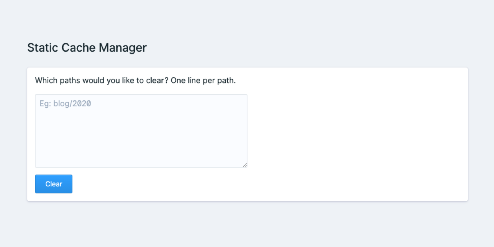

<!-- statamic:hide -->



## Static Cache Manager

<!-- /statamic:hide -->

Static Cache Manager is a simple Control Panel utility to clear specific paths in your site's static cache.

## Installation

First, require Static Cache Manager as a Composer dependency:

```
composer require doublethreedigital/static-cache-manager
```

And that's you done! The utility should now show in the Control Panel.

## Documentation

### Usage

1. Go to Utilities in the Statamic CP
2. Click on 'Static Cache Manager'
3. Enter in the paths you'd like to clear and click 'Clear' (you may provide wildcards: eg. `/news/2022/*`)
4. Hey presto! Static caching paths have been cleared.

## Support

Static Cache Manager is a free addon, because of this there is no direct support channel. If you have a feature request or experience a bug, please [open a GitHub Issue](https://github.com/duncanmcclean/static-cache-manager/issues/new/choose) and it'll be looked into over the next week or two.

> Only the latest version of this addon is supported. If you open a bug report using an old version, your issue will be closed.

## Sponsor me!

Some of my addons (including this one) are free & open-source, meaning you can use them in your site without buying any licenses.

However, there is a cost from my perspective to maintain this addon (fixing new bugs, adding new features, answering questions). That all takes time. I've spent over **5 hours** of my own time maintaining this addon over the past year.

If you use this software on your projects & can afford it, I'd appreciate it if you'd consider [sponsoring me](https://github.com/sponsors/duncanmcclean), even if it's just a couple dollars a month.

<!-- statamic:hide -->

---

<p>
<a href="https://statamic.com"></a>
<a href="https://packagist.org/packages/doublethreedigital/static-cache-manager/stats"></a>
</p>

<!-- /statamic:hide -->
